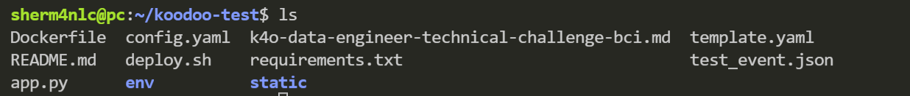
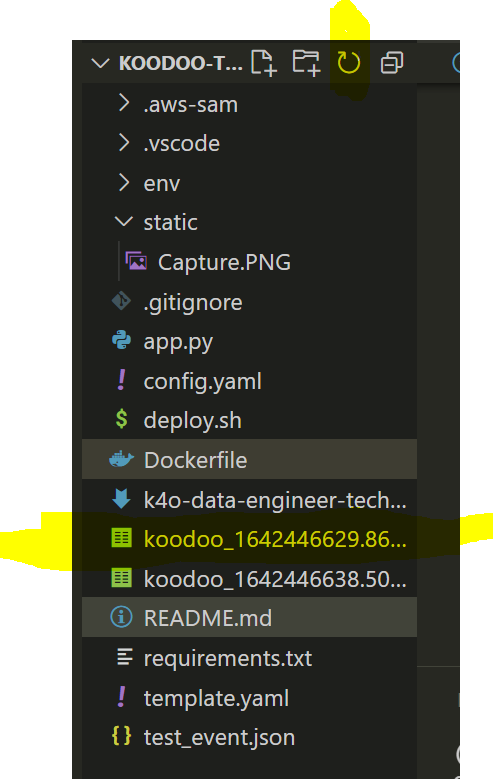
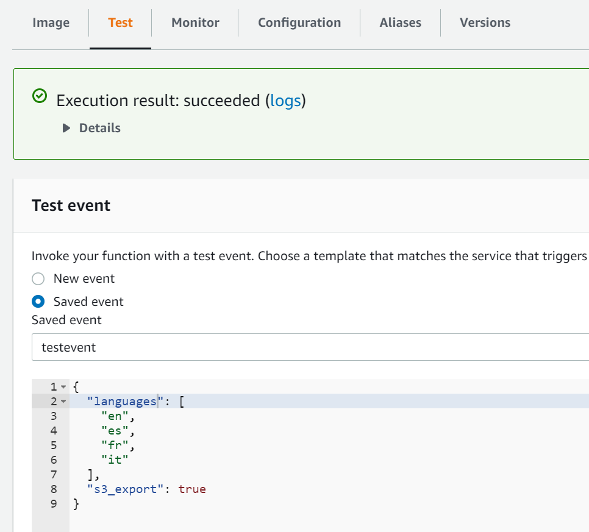
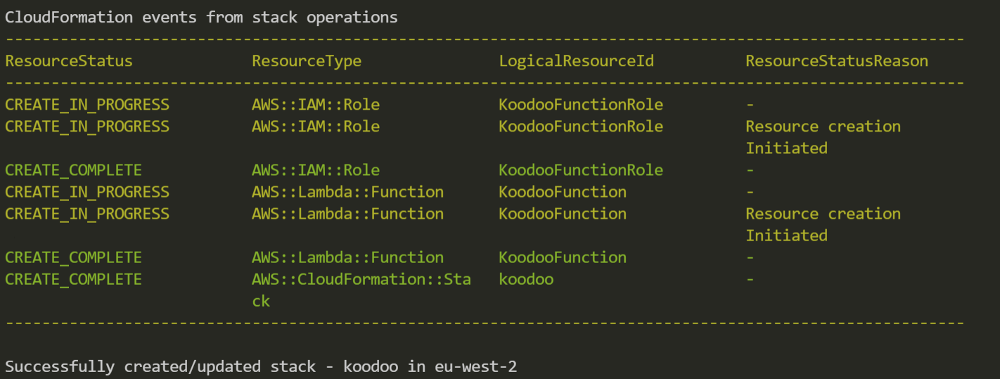
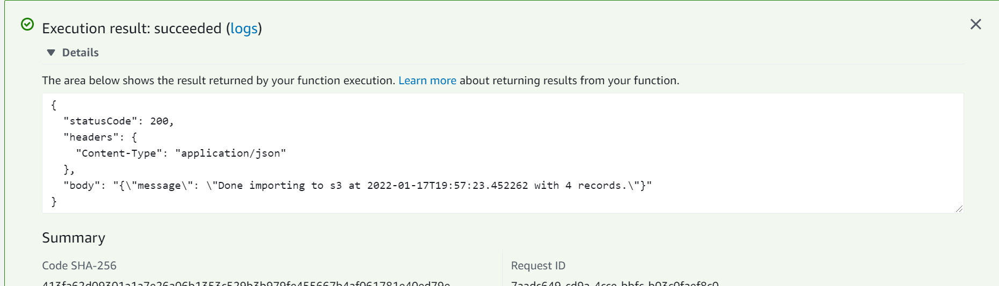

# RSS Ingestion

## About

This application downloads data from the endpoint `https://www.europarl.europa.eu/rss/doc/top-stories/` in the form of `csv` files to be stored in `AWS s3`.
It can also download to a local machine running as a python script within an environment.
It takes a parameter a list of languages, for example:

```
'languages':[
      'en',
      'es',
      'fr',
      'it'
      ]
```

## Local Run and Installation Linux, Windows WSL, MacOS

1. It would be required to have installed `python3`, if needed please follow the instructions accordingly on https://www.python.org/downloads/

2. You should in your terminal go to the root directory of the project -- if you `ls` you should see the following files


3. Having done so, you should be able to create an environment by doing `python3 -m venv env`. After that you should be able to run `source env/bin/activate`. You will notice that on the side of your prompt you have activated your environment. At that point you should install requirements with `pip install -r requirements.txt`

4. Configure `config.yaml` file. As this section is for local run, it's only relevant to add the list of languages you want to retrieve, for example
```
local_run_languages:
  - en
  - es
  - fr
  - it
```
5. To run you should enter `python app.py`, the script will run and will download to your current directory the csv file.


## Lambda About and Deployment

The script could be deployed as a Lambda that will take as an argument the languages requested, sending the produced csv file to a location of choice on `s3`.



### Prerequisites

To deploy it would be necessary. Having configured `aws cli` and `sam cli`, following these instructions
[aws cli](https://docs.aws.amazon.com/cli/latest/userguide/getting-started-install.html)
and
[sam linux/mac based](https://docs.aws.amazon.com/serverless-application-model/latest/developerguide/serverless-sam-cli-install-linux.html) or [sam windows](https://docs.aws.amazon.com/serverless-application-model/latest/developerguide/serverless-sam-cli-install-windows.html)

You should [configure credentials](https://docs.aws.amazon.com/cli/latest/userguide/cli-configure-quickstart.html). Check with your admin that your credentials have sufficient privileges to create and access AWS resources, lambdas, ecr, s3, etc.

You should have installed [docker](https://docs.docker.com/get-docker/)

### Deployment
1. Only 2 resources should be preexistent an `s3 bucket` for receiving the `csv` file and an `ECR repository` to store the `lambda` image.
2. Having those available you can configure `congif.yaml`<br>
`app_name` It will be used to pass a name to the CloudFormation Stack<br>
`region` It will be used to determine the region of the lambda<br>
`image_repo` It should be the one created where the lambda image will be stored<br>
`s3_bucket` Used as a destination to our files<br>
`endpoint_base` As our lambda is multipurpose for many languages, we only configure the base as needed<br>
`local_run_languages` Only used when running on local machine. It simulates the list of languages requested that on the lambda are actually passed as an `event`<br>

```
app_name: koodoo
region: eu-west-2
image_repo: 291399082936.dkr.ecr.eu-west-2.amazonaws.com/koodoo
s3_bucket: glc-01
endpoint_base: https://www.europarl.europa.eu/rss/doc/top-stories/{}.xml
local_run_languages:
  - en
  - es
  - fr
  - it
```
3. Run deploy script. This step would be adjusted ideally to a CI/CD tool. You can run it with `sh deploy.sh`. It will take the details from `config.yaml` to do the deployment. 



4. Test Lambda. At this point you should be able to find your lamda. You could test it with this test event:

```
{
"languages":[
      "en",
      "es",
      "fr",
      "it"
      ],
"s3_export": true
}
```


## Conclusion in response to considerations

- _Does it solve/run for the basic case?_
I believe it does, both on local and mock version of an app

- _Does it handle different scenarios?_
I tried to make it so it can handle different languages, still aggregating the data accordingly

- _How portable is it?_
It should be relatively portable considering anyone with python3 and virtual env should be able to install dependencies. If preferred to run on docker for greater compatibility it can also be doe with `sam local invoke -e test_event.json`

- _How does someone run it on any machine?_
I provided instructions on this README being as detailed as possible